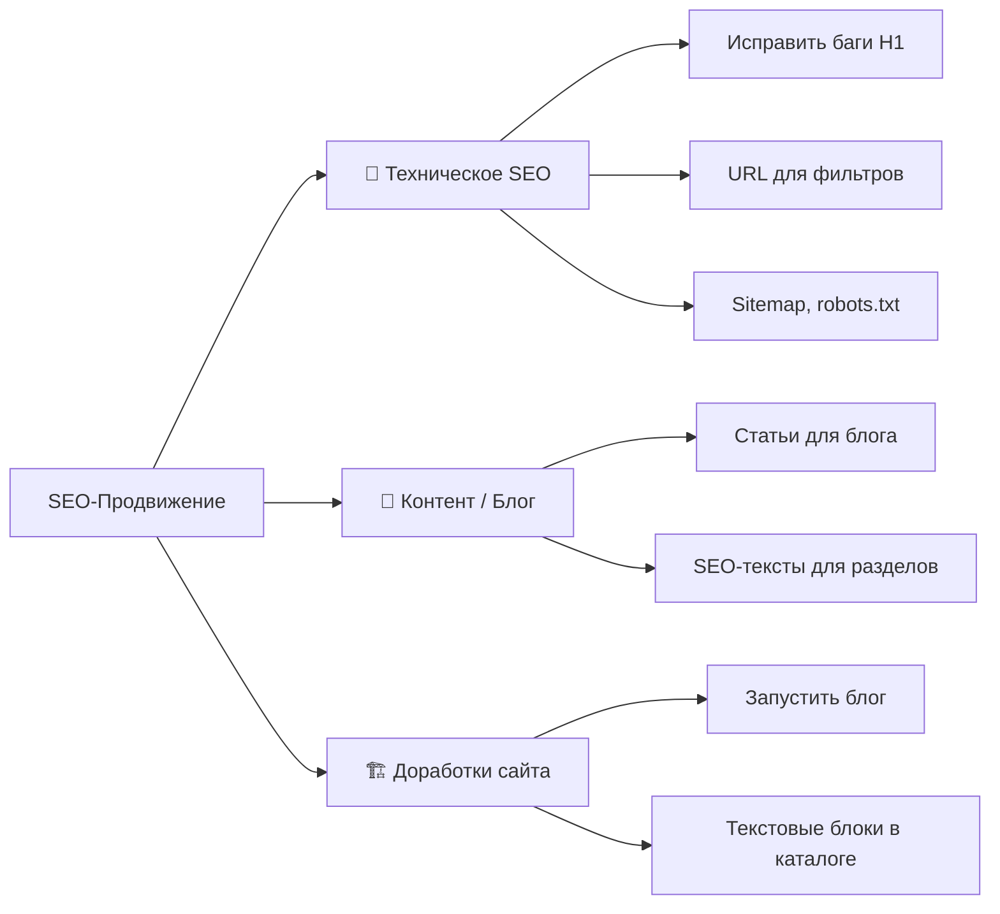

# Комплексный план SEO-продвижения rkkland.ru

> **Дата:** 12 февраля 2026  
> **Горизонт:** 2–3 недели активной работы

---

## Краткий аудит текущего состояния

### ✅ Сильные стороны
- **Чистые URL** — иерархия `/{район}/{посёлок}/{slug}` отлично индексируется
- **Schema.org** — `Product`, `BreadcrumbList`, `RealEstateAgent` уже внедрены
- **Быстрый сайт** — Next.js SSR, хорошая скорость загрузки
- **Уникальные мета-теги** — Title и Description прописаны для каталога и карточек

### ⚠️ Проблемы, требующие исправления

| # | Проблема | Критичность |
|---|---------|-------------|
| 1 | **Нет блога** — `/blog` выдаёт 404, `/news` пуст | 🔴 Высокая |
| 2 | **Нет SEO-текстов** на страницах каталога и районов | 🔴 Высокая |
| 3 | **Баг «в в»** в H1 районных страниц ("Продажа участков **в в** Гурьевском районе") | 🟡 Средняя |
| 4 | **Фильтры не меняют URL** — нет индексируемых страниц для ИЖС/СНТ/Промка | 🟡 Средняя |
| 5 | **H1 карточки слишком общий** — просто "Продажа участка" без деталей | 🟡 Средняя |

---

## Стратегия: 3 направления



---

## С чего начать? Первое действие

> [!IMPORTANT]
> **Шаг 1 — Исправить технические баги (день 1).**
> Пока нет контента, нужно привести в порядок то, что уже есть. Это быстрые правки, которые мы сделаем за 1 сессию:
> - Исправить дубль предлога «в в» в H1 районных страниц
> - Оптимизировать H1 карточки (добавить площадь и локацию)

---

## Подробный план по дням

### 📅 Блок 1: Техническое SEO (дни 1–2)

**День 1 — Быстрые фиксы**
- [ ] Исправить баг «в в» в H1 районных страниц
- [ ] Улучшить H1 карточки: `"Продажа участка"` → `"Участок {площадь} сот. в {посёлок} ({назначение})"`
- [ ] Проверить и дополнить мета-теги на всех типах страниц по шаблонам из `content_guidelines.md`
- [ ] Задеплоить фиксы

**День 2 — Индексация**
- [ ] Проверить `robots.txt` и `sitemap.xml`
- [ ] Подать сайт в Яндекс.Вебмастер и Google Search Console (если ещё не подан)
- [ ] Убедиться, что каждая районная страница есть в sitemap

---

### 📅 Блок 2: Запуск блога (дни 3–5)

> [!NOTE]
> Каркас `/news` уже есть в коде проекта (Next.js), но страница пуста. Нужно или переименовать его в `/blog`, или наполнить `/news` контентом и добавить ссылку в навигацию.

**День 3 — Инфраструктура блога**
- [ ] Решить: `/blog` или `/news` (рекомендую `/blog` — привычнее для SEO)
- [ ] Добавить ссылку на блог в навигацию
- [ ] Создать шаблон страницы статьи с правильной разметкой (H1, Schema.org `Article`)

**Дни 4–5 — Первые статьи (3–4 штуки)**

| # | Тема статьи | Целевой запрос | Объём |
|---|------------|---------------|-------|
| 1 | «Как выбрать участок под ИЖС в Калининграде: гид 2026» | `участок ИЖС Калининград`, `купить участок под строительство` | 3000–4000 знаков |
| 2 | «Обзор районов Калининградской области для покупки земли» | `районы Калининграда для жизни`, `где купить участок` | 4000–5000 знаков |
| 3 | «Дача в Калининградской области: СНТ, цены и подводные камни» | `купить дачу Калининград`, `участки СНТ` | 3000–4000 знаков |
| 4 | «Земельные участки для многодетных в Калининградской области» | `земельные участки многодетным` | 2000–3000 знаков |

---

### 📅 Блок 3: SEO-тексты для каталога (дни 6–8)

**Задача:** Добавить текстовые блоки внизу страниц каталога для ранжирования по ключам.

- [ ] Написать SEO-текст для **общего каталога** (1500–2000 знаков)
- [ ] Написать SEO-текст для **Гурьевского района** (500–1000 знаков)
- [ ] Написать SEO-текст для **Зеленоградского района** (500–1000 знаков)
- [ ] Написать SEO-тексты для остальных активных районов
- [ ] Реализовать компонент отображения SEO-текста (если ещё нет) — возможно через админку `settings`

---

### 📅 Блок 4: Расширение и продолжение (дни 9–14)

**Новые статьи (по 2–3 в неделю):**

| # | Тема | Целевой запрос |
|---|------|---------------|
| 5 | «Стоимость земли в Калининграде в 2026: анализ рынка» | `цены на участки Калининград`, `стоимость земли` |
| 6 | «Зеленоградский район: участки у моря» | `участок Зеленоградск`, `дача у моря` |
| 7 | «Гурьевский район: лучший пригород для дома» | `участок Гурьевск`, `купить участок под Калининградом` |
| 8 | «ИЖС vs СНТ: что выбрать для строительства дома» | `ИЖС или СНТ`, `разница ИЖС СНТ` |
| 9 | «Как проверить участок перед покупкой: чек-лист» | `проверить участок`, `кадастровая проверка` |
| 10 | «Переезд в Калининград: покупка земли для жителей других регионов» | `переезд в Калининград`, `купить землю Калининград` |

**Доработки сайта:**
- [ ] Сделать URL фильтров индексируемыми (опционально, низший приоритет)
- [ ] Внутренняя перелинковка: из статей блога → на каталог/районы

---

## Кто будет писать статьи?

> [!TIP]
> **Я (AI) могу писать все статьи.** Процесс будет такой:
> 1. Я генерирую черновик статьи по теме и ключам из семантического ядра
> 2. Ты просматриваешь, вносишь правки с учётом экспертизы (реальные детали, цены, специфика районов)
> 3. Я финализирую статью и добавляю её в проект (markdown → Next.js страница)
>
> **Рекомендация:** Для максимальной достоверности лучше добавлять реальные цифры, примеры объектов из вашей базы и локальные детали, которые знаешь только ты. AI-текст без фактуры ранжируется хуже.

---

## Приоритеты (резюме)

```
🔴 СРОЧНО (дни 1–2):    Технические фиксы (баг H1, мета-теги)
🟠 ВАЖНО  (дни 3–5):    Запуск блога + первые 3–4 статьи
🟡 НУЖНО  (дни 6–8):    SEO-тексты для разделов каталога
🟢 ЖЕЛАТЕЛЬНО (9–14):   Расширение контента, перелинковка
```
